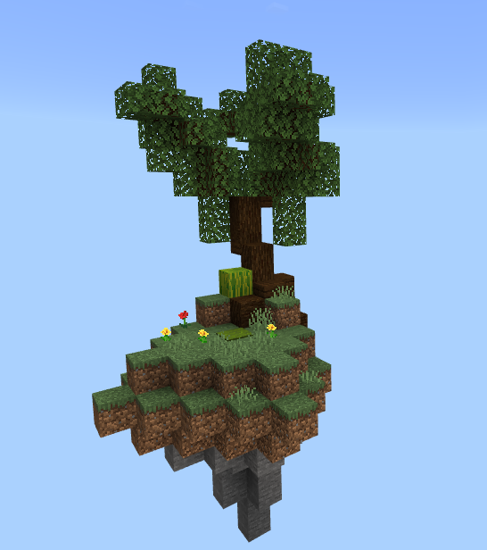

# AzSkyblock 

##### This plugin is still in development, and not ready for production use.

#### Description
Simple Skyblock game play plugin for PocketMine-MP, designed for LOCM Skyblock server.

#### Features
- [x] Custom islands
- [x] UI Support
- [ ] Skyblock Shop
- [x] SQLite3 Support
- [x] Join to island (when player first join to server, island will be created, and player will be teleported to island)
#### TODO
- [ ] Commands
- [ ] Events
- [ ] API
- [ ] Skyblock Shop
- [ ] Island Upgrades
- [ ] Generate next world when player reach border